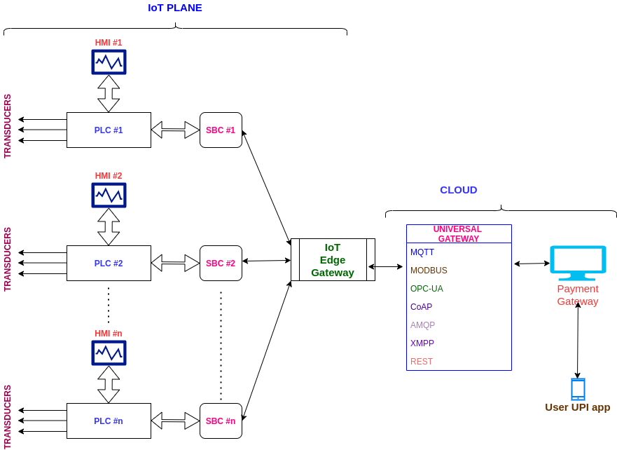
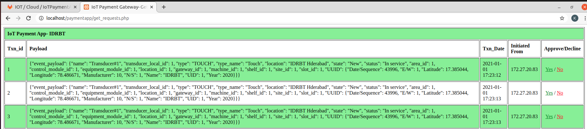

# IoTPaymentApp

The definition of a payment gateway is the technology that captures and transfers payment data from the customer to the acquirer and then transfers the payment acceptance or decline back to the customer. 

In other words, the payment gateway works as the middleman between customer and the merchant, ensuring the transaction is carried out securely and promptly. An online payment gateway can simplify how merchants integrate the necessary software. As the middleman during the payment processing, the gateway manages the customer’s sensitive card/account/UPI details between the acquirer and the merchant.

Here , in this IoT payment application, Payment request will come from MQTT broker. Subsequently, the payment request details will be inserted into MySQL database for triggering the actual transaction event to UPI or other financial infrastructure.

From MQTT broker, the transaction details(in json format) will come to IoT payment application through a web hook call.

Kindly see the below end to end data flow from transducer to IoT payment application.

Transducers => PLC => SBC => IoT Edge Gateway => Universal Gateway => MQTT Broker => IoT Payment App

Note*: DRAWIO xml file is located in (images/iot_gateway_new)

An event occurs at the transducer end and data will travel across all the above mentioned components and finally reaches to the IoT payment app.

The primary requirement for any web application is it should have a web server and database. In this project we have used Apache web server and MariaDB[MySQL] database which come with XAMPP installer package(xampp-linux-x64-7.4.10-0-installer.run).

In this case, The default web server root directory will be "/opt/lampp/htdocs/" (in some cases it will be "/var/www/html")

The project structure as follows:

# Project Structure
* => css[directory]
* => images[directory]
* => db.php[file]
* => getRequests.php[file]
* => postRequests.php[file]

## css
This directory contains all the CSS style sheet files.

## images
This directory contains all the image files.

## db.php
This file holds configuration and connection details of database. In this IoT Payment application, We are using MySQL database.

## getRequests.php
This script fetches data from database table and diplays on browser.

**Invoke URL in browser:** http://{server_ip}/{project_name}/getRequests.php

**Output:**

## postRequests.php
This script accepts POST requests(along with non empty data) from different end points.

**POST request example(using cURL) :** curl -X POST -d '{"payload":"eyJ0ZXN0IiA6IFsidGVzdDEiLCJ0ZXN0MiJdfQ=="}' http://{server_ip}/{project_name}/postRequests.php

Here, the json POST data contains base64 encoded value of {"test" : ["test1","test2"]} for json key "payload". This is the standard format for posting json data from any client to IoT Payment App.

# Installation procedure

## Step-1: Software Requirements
Install XAMPP server(xampp-linux-x64-7.4.10-0-installer.run) in Linux environment.After installation, We can check the version of the Apache Web Server and PHP versions.

**Web Server:**
* Apache - 2.4.46
* PHP - 7.4.10
* Database client version: libmysql - mysqlnd 7.4.10

**Database Server:**
* Server: localhost
* Server type: MariaDB
* Server version: 10.4.14-MariaDB - Source distribution

Start the services using XAMPP control panel.

## Step-2: Database and Table Creation
Create a database with name "iot" using phpmyadmin interface. Open this link in the browser http://localhost/phpmyadmin/index.php

CREATE DATABASE iot;

Create a table with table name as "json_data" under database "iot" using phpmyadmin.

**SQL query for creation of table :** 

CREATE TABLE `json_data` (
 `id` int(11) NOT NULL AUTO_INCREMENT,
 `data2` longtext DEFAULT NULL,
 `created_on` datetime DEFAULT current_timestamp(),
 `ip` varchar(50) NOT NULL,
 PRIMARY KEY (`id`)
) ENGINE=InnoDB DEFAULT CHARSET=utf8mb4;

**Note*:** In case If you want to have your own names for database,table and columns , You will need to change them in the {db.php} configuration file(or wherever required).

**Alternate procedure :** Database and table schema can be imported directly from database.sql file available in {assets} folder.

## Step-3: Clone the project repository

Clone this project repository to web server root directory "/opt/lampp/htdocs/{project_name}". Here the project name is the root directory of source code files.

Goto any browser and enter URL as "http://localhost/{project_name}/getRequests.php".

